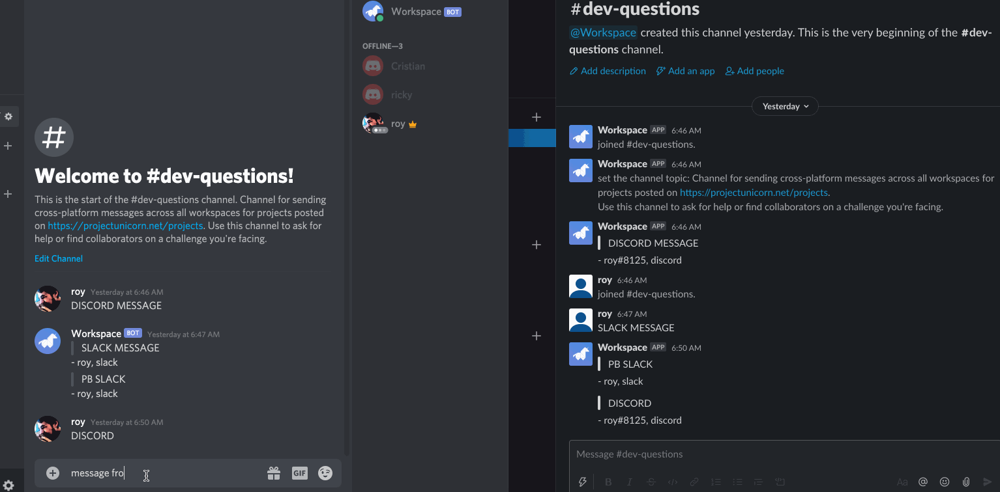

# Pub Workspace
## Summary
Pub workspace is a set of utility apps that can be installed on project workspaces where teams collaborate (e.g. slack, discord, etc.). Currently supported workspace platforms include Slack and Dicord. 

Although we strive for feature parity across all workspace apps - they are dependent on the APIs supported by each platform.

## Features

### Cross-Workspace Messages (supported on Slack, Discord)
Ask for help and get help on your project from developers across other project workspaces through a shared #dev-questions channel.

#### Demo

## Documentation

- [Contributing](./docs/CONTRIBUTING.md)